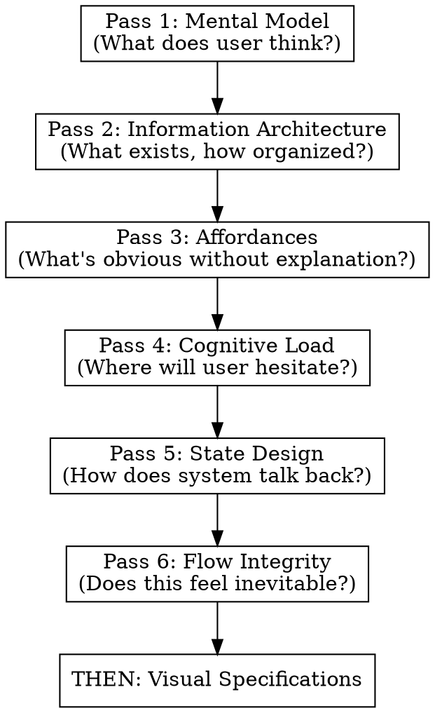

# PRD to UX Translation

## Overview

Translate product requirements into UX foundations through **6 forced designer mindset passes**. Each pass asks different questions that visual-first approaches skip.

**Core principle:** UX foundations come BEFORE visual specifications. Mental models, information architecture, and cognitive load analysis prevent "pretty but unusable" designs.

## When to Use

- Translating PRD/spec to mockup tool input (Google Stitch, Figma, etc.)
- Creating UX specifications from feature requirements
- Preparing design handoff documents
- Before any visual design work

## Output Location

**Write the UX specification to a file in the same directory as the source PRD.**

Naming convention:
- If PRD is `feature-x.md` → output `feature-x-ux-spec.md`
- If PRD is `PRD.md` → output `UX-spec.md`
- If PRD is `requirements.md` → output `requirements-ux-spec.md`

Pattern: `{prd-basename}-ux-spec.md` (or just `UX-spec.md` if PRD has generic name)

**Do not output to conversation.** Always write to file so the spec is persistent and can be passed to mockup tools.

## The Iron Law

```
NO VISUAL SPECS UNTIL ALL 6 PASSES COMPLETE
```

**Not negotiable:**
- Don't mention colors, typography, or spacing until Pass 6 is done
- Don't describe screen layouts until information architecture is explicit
- Don't design components until affordances are mapped

**No exceptions for urgency:**
- "I'm in a hurry" → Passes take 5 minutes; fixing bad UX takes days
- "Just give me screens" → Screens without foundations need rework
- "Skip the analysis" → Analysis IS the value; screens are just output
- "I know what I want" → Then passes will be fast; still do them

Skipping passes to "save time" produces specs that need redesign. The 6 passes ARE the shortcut.

## The 6 Passes

Execute these IN ORDER. Each pass produces required outputs before the next begins.



---

### Pass 1: User Intent & Mental Model Alignment

**Designer mindset:** "What does the user think is happening?"

**Force these questions:**
- What does the user believe this system does?
- What are they trying to accomplish in one sentence?
- What wrong mental models are likely?

**Required output:**
```markdown
## Pass 1: Mental Model

**Primary user intent:** [One sentence]

**Likely misconceptions:**
- [Misconception 1]
- [Misconception 2]

**UX principle to reinforce/correct:** [Specific principle]
```

---

### Pass 2: Information Architecture

**Designer mindset:** "What exists, and how is it organized?"

**Force these actions:**
1. Enumerate ALL concepts the user will encounter
2. Group into logical buckets
3. Classify each as: Primary / Secondary / Hidden (progressive)

**Required output:**
```markdown
## Pass 2: Information Architecture

**All user-visible concepts:**
- [Concept 1]
- [Concept 2]
- ...

**Grouped structure:**

### [Group Name]
- [Concept]: [Primary/Secondary/Hidden]
- Rationale: [One sentence why this grouping]

### [Group Name]
...
```

**This is where most AI UX attempts fail.** If you skip explicit IA, your visual specs will be disorganized.

---

### Pass 3: Affordances & Action Clarity

**Designer mindset:** "What actions are obvious without explanation?"

**Force explicit decisions:**
- What is clickable?
- What looks editable?
- What looks like output (read-only)?
- What looks final vs in-progress?

**Required output:**
```markdown
## Pass 3: Affordances

| Action | Visual/Interaction Signal |
|--------|---------------------------|
| [Action] | [What makes it obvious] |

**Affordance rules:**
- If user sees X, they should assume Y
- ...
```

No visuals required—just clarity on what signals what.

---

### Pass 4: Cognitive Load & Decision Minimization

**Designer mindset:** "Where will the user hesitate?"

**Force identification of:**
- Moments of choice (decisions required)
- Moments of uncertainty (unclear what to do)
- Moments of waiting (system processing)

**Then apply:**
- Collapse decisions (fewer choices)
- Delay complexity (progressive disclosure)
- Introduce defaults (reduce decision burden)

**Required output:**
```markdown
## Pass 4: Cognitive Load

**Friction points:**
| Moment | Type | Simplification |
|--------|------|----------------|
| [Where] | Choice/Uncertainty/Waiting | [How to reduce] |

**Defaults introduced:**
- [Default 1]: [Rationale]
```

---

### Pass 5: State Design & Feedback

**Designer mindset:** "How does the system talk back?"

**Force enumeration of states for EACH major element:**
- Empty
- Loading
- Success
- Partial (incomplete data)
- Error

**For each state, answer:**
- What does the user see?
- What do they understand?
- What can they do next?

**Required output:**
```markdown
## Pass 5: State Design

### [Element/Screen]

| State | User Sees | User Understands | User Can Do |
|-------|-----------|------------------|-------------|
| Empty | | | |
| Loading | | | |
| Success | | | |
| Partial | | | |
| Error | | | |
```

This prevents "dead UX"—screens with no feedback.

---

### Pass 6: Flow Integrity Check

**Designer mindset:** "Does this feel inevitable?"

**Final sanity check:**
- Where could users get lost?
- Where would a first-time user fail?
- What must be visible vs can be implied?

**Required output:**
```markdown
## Pass 6: Flow Integrity

**Flow risks:**
| Risk | Where | Mitigation |
|------|-------|------------|
| [Risk] | [Location] | [Guardrail/Nudge] |

**Visibility decisions:**
- Must be visible: [List]
- Can be implied: [List]

**UX constraints:** [Any hard rules for the visual phase]
```

---

## THEN: Visual Specifications

Only after all 6 passes are complete, create:
- Screen layouts
- Component specifications
- Design system (colors, typography, spacing)
- Interaction specifications
- Responsive breakpoints

The 6 passes inform every visual decision.

## Red Flags - STOP and Restart

If you catch yourself doing any of these, STOP and return to the passes:

| Violation | What You're Skipping |
|-----------|---------------------|
| Describing colors/fonts | All foundational passes |
| "The main screen shows..." | Pass 1-2 (mental model, IA) |
| Designing components before actions mapped | Pass 3 (affordances) |
| No friction point analysis | Pass 4 (cognitive load) |
| States only in component specs | Pass 5 (holistic state design) |
| No "where could they fail?" | Pass 6 (flow integrity) |
| "User is in a hurry" | ALL passes — urgency is a trap |
| "Just this once, skip to visuals" | ALL passes — exceptions become habits |
| "The PRD is simple enough" | ALL passes — simple PRDs still need mental model analysis |

## Common Mistakes

**Merging passes:** "I'll cover mental model while doing IA" → You won't. Separate passes force separate thinking.

**Skipping to visuals:** "The PRD is clear, I can design screens" → Baseline testing shows agents skip 4+ passes when allowed.

**Implicit affordances:** "Buttons are obviously clickable" → Map EVERY action explicitly. What's obvious to you isn't obvious to users.

**Scattered state design:** "I'll add states to each component" → Holistic state table in Pass 5 catches gaps.

## Output Template

```markdown
# UX Specification: [Product Name]

## Pass 1: Mental Model
[Required content]

## Pass 2: Information Architecture
[Required content]

## Pass 3: Affordances
[Required content]

## Pass 4: Cognitive Load
[Required content]

## Pass 5: State Design
[Required content]

## Pass 6: Flow Integrity
[Required content]

---

## Visual Specifications
[Only after passes complete]
```